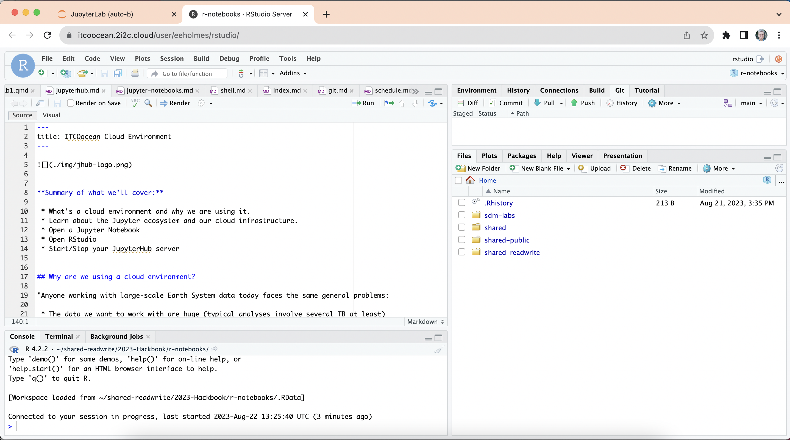

## Summary

In this tutorial, we will provide a brief introduction to:

1.  RStudio in the JupyterHub
2.  Basic navigation around  **RStudio**: the 4 main panels and menus
3.  The help panel
4.  Create a RStudio project
4.  Creating files and creating files with templates
5.  Command line (**terminal**/shell) in RStudio

## Open RStudio in the JupyterHub

1. Login the JupyterHub
2. Click on the RStudio button when the Launcher appears

3. Look for the browser tab with the RStudio icon

## Basic Navigation



## Create an RStudio project

1. Open RStudio
2. **In the file panel**, click on the Home icon to make sure you are in your home directory
2. **From the file panel**, click "New Project" to create a new project
3. In the pop up, select New Directory and then New Project
3. Name it `sandbox`
4. Click on the dropdown in the upper right corner to select your `sandbox` project
5. Click on Tools > Project Options > General and change the first 2 options about saving and restoring the workspace to "No"

## Creating files

When you start your server, you will have access to your own virtual drive space. No other users will be able to see or access your files. You can upload files to your virtual drive space and save files here. You can create folders to organize your files. You personal directory is `home/jovyan`. Everyone has the same home directory but your files are separate and cannot be seen by others.

There are a number of different ways to create new files. Let's practice making new files in RStudio.

### R Script

1. Open RStudio
2. **In the upper right**, make sure you are in your `sandbox` project.
5. **From the file panel**, click on "New Blank File" and create a new R script.
6. Paste
```
print("Hello World")
1+1
```
in the script.
7. Click the Source button (upper left of your new script file) to run this code.
8. Try putting your cursor on one line and running that line of code by clicking "Run"
9. Try selecting lines of code and running that by clicking "Run"

### csv file

1. **From the file panel**, click on "New Blank File" and create a Text File.
2. The file will open in the top left corner. Paste in the following:
```
name, place, value
A, 1, 2
B, 10, 20
C, 100, 200
```
3. Click the save icon (above your new file) to save your csv file

### A Rmarkdown document

Now let's create some more complicated files using the RStudio template feature.

1. From the upper left, click File -> New File -> RMarkdown
2. Click "Ok" at the bottom.
3. When the file opens, click Knit (icon at top of file).
4. It will ask for a name. Give it one and save.
5. You file will render into html.

[Reference sheet for writing in RMarkdown](https://www.rstudio.com/wp-content/uploads/2015/03/rmarkdown-reference.pdf) or go to Help > Markdown Quick Reference

### A Rmarkdown presentation

1. From the upper left, click File -> New File -> RMarkdown
2. Click "Presentation" on left of the popup and click "Ok" at the bottom.
3. When the file opens, click Knit (icon at top of file).
4. It will ask for a name. Give it one and save.
5. You file will render into html.

### An interactive application

1. From the upper left, click File -> New File -> Shiny Web App
2. In the popup, give the app a name and make sure the app is saved to `my-files`
3. When the file opens, Run App (icon at top of file).

### And many more

Play around with creating other types of documents using templates. Especially if you already use RStudio.

## More tips

Learn some tips and tricks from these

* https://colorado.posit.co/rsc/the-unknown/into-the-unknown.html
* https://www.dataquest.io/blog/rstudio-tips-tricks-shortcuts/
